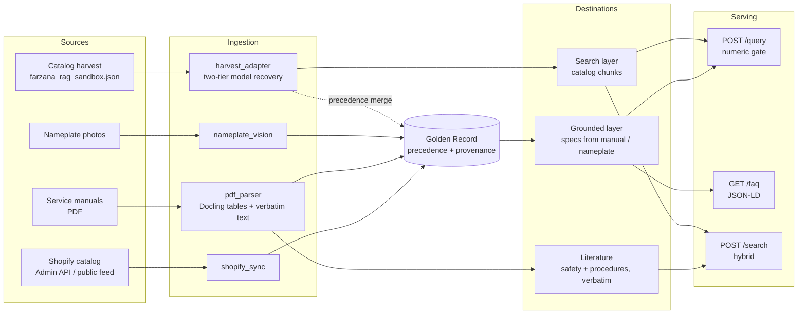

# Genemco Catalog RAG — Handover

Handover documentation for the Genemco retrieval system: architecture, schemas,
source mappings, ingestion evidence, the `/query` API, and how to operate it.

Everything below reflects the system as built and run. Items that depend on the
manual corpus (Muiz) or on inputs from Genemco are marked **PENDING** with the owner.

| Document | Purpose |
|---|---|
| [`docs/HANDOVER.md`](HANDOVER.md) | This file — architecture, schemas, logs, maintenance |
| [`docs/QUERY_API.md`](QUERY_API.md) | `/query` contract reference with real request/response pairs |
| [`docs/DEPLOYMENT.md`](DEPLOYMENT.md) | Deploying the query service behind the Worker |
| [`reports/milestone2_streamA_report.md`](../reports/milestone2_streamA_report.md) | Stream A completion evidence |

---

## 1. What the system does

It turns three kinds of source material into answers a buyer or technician can
trust:

- **Service manuals** (PDF) — engineering values with the page they came from.
- **Nameplate photos** — values read off the physical machine.
- **Catalog listings** — Genemco's product pages, for identity and search.

The central rule: **a number is only ever stated if it can be traced to a source,
and it is only called *verified* when that source is an engineering document.**
If a value cannot be grounded, the system says so instead of answering.

## 2. Status at a glance

| Area | Status |
|---|---|
| Golden Record schema, provenance, precedence | Done |
| PDF manual parsing (Docling), multi-model manuals | Done — validated on Frick 070.410-IOM |
| Safety text kept verbatim, barred from FAQs | Done |
| Catalog harvest adapter (two-tier model recovery) | Done |
| Catalog → search layer, Stream A run | Done — 15,939 / 15,939 |
| Numeric verification gate | Done |
| Grounded FAQ engine (manual sources only) | Done |
| `POST /query` verified endpoint, deployable service | Done — not yet deployed |
| Deployment behind the Worker | **PENDING — Genemco / Muiz** (see `DEPLOYMENT.md`) |
| Active Stream A SKU list (6,084) | **PENDING — Genemco** (list or Admin API token) |
| Manual corpus CORPUS_V1 ingestion | **PENDING — Muiz** (4 of 5 archive parts missing) |
| Search-layer embeddings / upsert | **PENDING — approval** (separate index required) |
| Nameplate photos | **PENDING — Genemco** |
| Genemco telemetry schema | **PENDING — Genemco** (built-in default in use) |

## 3. Architecture



**Three destinations, deliberately separate:**

| Destination | Holds | Feeds | Never feeds |
|---|---|---|---|
| Grounded layer | Specs from `pdf_manual` / `nameplate` | `/query` (verified), `/faq` | — |
| Literature | DANGER / WARNING / procedures, verbatim, with page | `/search` | FAQ generator |
| Search layer | Catalog listing specs (`catalog_harvest`) | `/query` (unverified), `/search` | FAQ generator |

The FAQ generator reads only `pdf_manual`, `nameplate` and `telemetry` specs
(`faq/generator.py::FAQ_ELIGIBLE_SOURCES`). A catalog-only SKU returns zero FAQs
before any LLM call is made.

## 4. Repository map

| Path | Purpose |
|---|---|
| `core/schemas.py` | All Pydantic models — Golden Record, SpecValue, Chunk, FAQ, telemetry |
| `core/config.py` | Settings, read from environment / `.env` |
| `ingestion/shopify_sync.py` | Shopify Admin API and public-storefront sync |
| `ingestion/pdf_parser.py` | Docling table linearization, safety/procedure extraction |
| `ingestion/manual_map.py` | Manual → SKU manifest, RXF → XJF model tiers, model matching |
| `ingestion/nameplate_vision.py` | Vision-LLM nameplate extraction |
| `ingestion/harvest_adapter.py` | Catalog harvest → Golden Record |
| `ingestion/golden_record.py` | Record build, source precedence, `merge_catalog_specs` |
| `pipeline/chunking.py` | Spec, literature and catalog chunks |
| `pipeline/embeddings.py`, `vector_store.py` | Batched embeddings, Pinecone / Weaviate |
| `retrieval/hybrid_search.py`, `reranker.py` | Dense + BM25 + RRF + cross-encoder |
| `retrieval/verified_query.py` | `/query` engine — store, resolution, gate, citations |
| `faq/generator.py`, `faq/validator.py` | Grounded FAQs and the numeric gate |
| `api/query_app.py` | **Deployable** query service (`/health`, `/query`) |
| `api/query.py` | `/query` router and Worker shared-secret check |
| `api/main.py` | Full application (`/search`, `/faq`, `/telemetry/query`, `/query`) |
| `scripts/run_catalog_search_layer.py` | Catalog → search layer runner (Stream A) |
| `scripts/ingest_sku.py`, `run_milestone1.py`, `run_full_ingestion.py` | Pipeline runners |
| `tests/` | Test suite |
| `reports/` | Shareable run reports |
| `data/`, `logs/` | Runtime data and logs — **gitignored** |

## 5. Golden Record schema

One record per SKU (`core/schemas.py`).

```text
GoldenRecord
  sku              Shopify SKU; immutable identity
  shopify          ShopifyBlock   commercial identity (title, url, tags, stock, sync_mode)
  specs            {field: SpecValue}
  telemetry        {field: value}
  merge_meta       MergeMeta
  record_version, last_built

SpecValue                          every technical value carries full provenance
  value            the value (number or text)
  unit             unit, when the source states one
  source           shopify | pdf_manual | nameplate | telemetry | stream_c | catalog_harvest
  source_ref       "<manual>.pdf#page=N" | "nameplate:<sku>" | source URL
  method           docling_table | vision_llm | catalog_atomic | catalog_bundle_recovered | catalog_compound
  confidence       0–1
  source_text      verbatim source text the value was read from (citation quote)

MergeMeta
  conflicts        [{field, candidates[], reason}]   disagreements kept, never overwritten
  sources_used     [...]
  pdf_enrichment, nameplate_enrichment
  source_warnings  integrity notes raised by the source (e.g. serial_not_unique)
```

### Source precedence

| Field type | Winner |
|---|---|
| Electrical / serial (voltage, amperage, HP, phase, Hz, RPM, serial, year, refrigerant) | Nameplate |
| Dimensional / performance | PDF manual |
| Any technical field vs a catalog listing | Manual or nameplate — always |
| Commercial identity (title, URL, stock) | Shopify / catalog |

- A numeric disagreement beyond **5%** (`NUMERIC_CONFLICT_TOLERANCE_PCT`) is logged to
  `merge_meta.conflicts` and `logs/conflicts.jsonl`. The authoritative value stands.
- Catalog specs fill gaps **only** for SKUs that have no manual at all.
- Nameplate extractions below **0.7** confidence go to `logs/review_queue.jsonl`.

### Confidence values in use

| Source | Confidence |
|---|---|
| `pdf_manual` (Docling table) | 0.9 |
| `nameplate` | per-field, from the vision model |
| `catalog_harvest` atomic value | 0.5 |
| `catalog_harvest` recovered from a bundled string | 0.4 |
| `catalog_harvest` compound value kept whole | 0.35 |

All catalog confidences sit below the 0.7 review threshold by design.

## 6. Field mappings

### 6a. Shopify → `ShopifyBlock`

| Shopify | Golden Record | Note |
|---|---|---|
| first variant `sku` (else `handle`) | `sku` | |
| `title`, `handle`, `vendor`, `product_type` | same | |
| `tags` | `tags[]` | Admin: comma string · public feed: list — both handled |
| variant `inventory_quantity` / `available` | `inventory_status` | public feed has no counts |
| `images[].src` | `images[]` | |
| — | `sync_mode` | `admin_api` or `public_storefront` |

### 6b. Catalog harvest (v4) → Golden Record

Source: `farzana_rag_sandbox.json` — 15,939 records. Adapter: `ingestion/harvest_adapter.py`.

| Harvest field | Golden Record | Note |
|---|---|---|
| `id` | `sku` | Shopify SKU; 38 records use a URL fallback for 19 reused SKUs |
| `sku` | cross-check only | |
| `raw_model_code` | `shopify.title`; `package_model`, `compressor_model` | parsed from the title convention |
| `clean_model_code` | **not used** | collapses RXF-85-H and RXF-85H — 271 collisions |
| `atomic_specs` | `specs` (`catalog_atomic`, 0.5) | flattened view |
| `specs` (bundled) | recovered `specs` (`catalog_bundle_recovered`, 0.4) | restores values the flattening dropped |
| `verified_specs[].source_url` | `SpecValue.source_ref` | |
| `verified_specs[].source_page` | **not used as a page** | identical to `source_url` in all 66,334 entries |
| `spec_field` / `value` | numeric-gate target | coerced like the stored spec |
| `source_data_warnings` | `merge_meta.source_warnings` | 353 `serial_not_unique`, carried not corrected |
| `equipment_category` | `shopify.product_type` | |
| `question`, `answer`, `token_count` | **not used** | one templated question across all records |

The v4 `atomic_specs` flattening drops a nested value whenever its key collides with a
top-level key — erasing the compressor model (XJF151L) on packaged units (RXF-85-H).
The adapter reads both containers and recovers it. 288 records were affected; all recover.

### 6c. PDF manual (Docling) → `SpecRecord` → `SpecValue`

| Docling output | Golden Record |
|---|---|
| Table row / column labels | `SpecRecord.model`, `spec` (normalized) |
| Cell text | `value`, `unit` (unit recovered from `(PSI)`-style headers) |
| `table.prov[0].page_no` | `source_ref = "<manual>#page=N"` |
| Row + column + cell | `source_text` = `"<model> \| <label>: <cell>"` |

Multi-model manuals are filtered per SKU using `data/manual_map.json` (manual → SKUs)
and `data/model_map.json` (SKU → models, RXF → XJF). Model labels are matched exactly,
including variant letters (XJF 151A/M/L/N), comma lists (`85, 101`) and ranges (`12 - 19`).

### 6d. Manual corpus (CORPUS_V1) → Golden Record — **PENDING (Muiz)**

Known from `corpus_manifest.csv` (the only CORPUS_V1 file available so far):

| Manifest column | Planned mapping |
|---|---|
| `doc_id` | manual identity; key into the JSON sidecar |
| `manufacturer`, `model_family` | model matching for `manual_map.json` |
| `confidence_level` | ingest order — High (915) first; Low (884) needs manual re-check |
| `page_count` | capacity planning |
| `source_url` | `manual_urls.json` → `citation.url` in `/query` |
| `query_source` | traceability only |

**Not yet known:** the JSON sidecar schema (no sidecar extracted), and whether page
numbers survive for non-Frick layouts. Both are confirmed only when the corpus is
reconstructed. The `/query` engine needs no change: manual-derived records go into the
authoritative directory and are picked up on restart.

### 6e. Chunk types

| `doc_type` | Built from | Chunk id | Reaches FAQ? |
|---|---|---|---|
| `shopify` | identity block | `sha1(sku\|identity)` | no |
| `spec` | authoritative specs | `sha1(sku\|field)` | yes |
| `literature` | safety / procedure text, verbatim | `sha1(sku\|manual\|page\|i)` | no |
| `catalog` | catalog harvest specs | `cat_` + `sha1(sku\|field)` | no |

The `cat_` prefix stops a catalog upsert from overwriting the grounded chunk for the
same SKU and field.

## 7. Ingestion execution log summary

### Milestone 1

| Run | Result |
|---|---|
| Public-storefront validation (20 SKUs) | 20 / 20 complete |
| Frick 070.410-IOM manual (68 pages) | 34 tables detected; 116 rows; 14 specs each for WHB03 / WHB02 |
| Safety extraction | 96 distinct panels, verbatim, page-cited |
| Grounded FAQs (WHB03) | 5 published, 1 rejected by the numeric gate |
| Exceptions | 4 — all intentional skips (table of contents, pressure-transducer grid) |

### Milestone 2 — Stream A catalog run

Evidence: [`reports/milestone2_streamA_report.md`](../reports/milestone2_streamA_report.md).

| Measure | Value |
|---|---|
| Records processed | 15,939 (entire harvest) |
| Completed | 15,939 — **100%** |
| Failed | 0 |
| Completed with at least one spec | 15,937 (99.99%) |
| Specs produced | 72,724 |
| Search chunks produced | 88,663 |
| Dual-source SKUs (manual + catalog) | 20 |
| Catalog values blocked by manual | 30 |
| Conflicts logged (manual wins) | 3 |
| Manual spec sets altered | **0** |
| Duplicate-serial flags carried | 353 |
| Run time | 8.9 s |

**Caveat:** no data held identifies the 6,084 active SKUs, so the run covered the whole
harvest. With zero failures, any 6,084-SKU subset completes at 100% — provided every
active SKU is present in the harvest, which needs the Stream A list to confirm.

### CORPUS_V1 manifest check

| Check | Result |
|---|---|
| Documents in manifest | 2,583 |
| Confidence tiers High / Medium / Low | 915 / 784 / 884 — matches handover |
| sha256 entries | 5,166 (2,583 PDFs + 2,583 sidecars) |
| High tier | 180 manufacturers, 54,187 pages; Frick is 15 of 915 |
| Archive parts present | **1 of 5** (`.04` only) — **cannot be reconstructed** |

### Where logs live

| File | Contents |
|---|---|
| `logs/exceptions.jsonl` | unparseable PDFs, skipped tables, FAQ gate rejections |
| `logs/conflicts.jsonl` | precedence conflicts |
| `logs/review_queue.jsonl` | low-confidence nameplate extractions |
| `logs/milestone1_report.json` | Milestone 1 validation run |
| `logs/milestone2_streamA_report_detail.json` | per-SKU Stream A outcomes |
| `reports/milestone2_streamA_report.{md,json}` | shareable Stream A summary |

## 8. `/query` API (summary)

Full reference with captured examples: [`docs/QUERY_API.md`](QUERY_API.md).

```text
POST /query   {query, model_code?, top_k?}
          ->  {answer, verified, confidence, citations[], ungrounded}
citation      {manual, manual_slug, source_page, url, quoted_span}
```

- Every number in `answer` passes the numeric gate against the cited values, or the
  answer is withheld (`answer: null`, `ungrounded: true`).
- `verified: true` only for manual (with page) or nameplate sources.
- Catalog values can answer, but always with `verified: false`.
- Unknown machine, a spec the machine does not carry, or matching machines that
  disagree → `ungrounded: true`. The reason is in the `X-Query-Outcome` header.
- Manufacturer words in a question never count as the spec asked for, and serial,
  part and certificate fields answer only when the question asks for them — otherwise
  "horsepower" on a Vilter package could match a Vilter oil-separator serial number.
- Citations are de-duplicated: SKUs sharing one manual page produce one citation.

## 9. Operations and maintenance

### Run the query service

```bash
pip install -r requirements-query.txt
GENEMCO_API_HOST=127.0.0.1 GENEMCO_API_PORT=9000 python -m api.query_app
curl -s http://127.0.0.1:9000/health
```

Configuration is environment-only; see [`docs/DEPLOYMENT.md`](DEPLOYMENT.md).
The service loads records at startup, so **restart it after any data refresh**.

### Refresh the catalog search layer

```bash
python -m scripts.run_catalog_search_layer                       # whole harvest
python -m scripts.run_catalog_search_layer --sku-list data/stream_a_skus.csv
```

Writes `data/search_layer/*.jsonl` atomically, never writes authoritative records,
and regenerates `reports/milestone2_streamA_report.*`. Conflicts append to
`logs/conflicts.jsonl` on each run.

### Add a service manual

1. Put the PDF in `data/pdf_manuals/`.
2. If it covers several SKUs, add it to `data/manual_map.json`; add model tiers to
   `data/model_map.json` if titles do not carry them.
3. Re-ingest those SKUs (`scripts/ingest_sku.py`). Check `logs/exceptions.jsonl` for
   skipped tables and the table inventory for layouts the parser does not handle.
4. Restart the query service.

### Onboard the manual corpus — **PENDING (Muiz)**

1. Obtain all five `gencorpus_v1.tar.0*` parts.
2. Join, extract, and verify with `sha256sum -c corpus.sha256` **inside the extracted tree**.
3. Ingest **High** confidence first, starting with a micro-sample; confirm page citations
   are real for non-Frick layouts before scaling.
4. Build `data/manual_urls.json` from `corpus_manifest.csv` `source_url`.
5. Budget CPU, not API spend: Docling processed 68 pages in about 13 minutes on the
   development machine; the High tier is 54,187 pages.

### Monitor

| Signal | Action |
|---|---|
| New lines in `logs/exceptions.jsonl` | Unparseable PDFs or skipped tables — review |
| New lines in `logs/conflicts.jsonl` | Sources disagree — decide which is right |
| Entries in `logs/review_queue.jsonl` | Nameplates below 0.7 confidence — human check |
| `/health` returning 503 | Records not loaded — check data paths |
| High share of `ungrounded` in `X-Query-Outcome` | Missing specs or unmatched wording |

### Rotate secrets

Secrets live only in environment variables (or `.env`, which is gitignored). Rotate the
value at the provider, update the environment, restart the process. `QUERY_UPSTREAM_TOKEN`
must be changed on the Worker and the service together.

### Tests

```bash
pytest tests/ -v
```

## 10. Known limitations

- Catalog data comes from the public product feed: no inventory counts, cost, or
  unpublished products until the Shopify Admin token is supplied.
- Catalog `source_page` is a URL, so catalog citations have no page number.
- Manual citations have `url: null` until `manual_urls.json` is populated.
- Allowable Flange Loads and CH Coupling Data tables are keyed by nozzle / coupling size,
  not model, so they are not attached to SKUs; coupling fractions decode incorrectly.
- Shared manuals are stored per SKU (duplicated literature chunks) — restructure before
  the full corpus.
- The FAQ gate rejects numbers that appear only in a column heading (e.g. "3550" in
  "Cfm 3550 Rpm"). Kept strict by decision.
- Precedence rules have not yet been exercised against a real nameplate.
- Values stated only in a product title — e.g. horsepower and voltage in
  "(Vilter VSS1201, 500 Hp, 460 V)" — are not in `specs{}`, so `/query` does not answer them.
- The catalog contradicts itself in places: XJB151 listings show 7,000 RPM on TPC46 / TPC47
  but 700 RPM on TPC28. `/query` refuses such questions rather than choosing a value;
  these are catalog-side corrections for Genemco.
- `/query` resolves a machine by model code or SKU; queries naming no machine are refused.
  Retrieval is lexical over Golden Records; vector retrieval can be added behind the same
  contract.

## 11. Pending items

| Item | Owner | Unblocks |
|---|---|---|
| CORPUS_V1 parts `.00`–`.03` | Muiz | Manual-corpus ingestion, grounded layer at scale |
| CORPUS_V1 JSON sidecar schema confirmation | Muiz | Manual field mapping (6d) |
| Deployment target and access | Genemco / Muiz | `/query` live behind the Worker |
| Worker upstream switch + shared token | Muiz | Worker → `/query` |
| Stream A active SKU list, or Shopify Admin API token | Genemco | 6,084-SKU coverage proof; inventory data |
| Separate vector index / namespace for the search layer | Genemco (approval) | Catalog embeddings |
| Nameplate photos | Genemco | Nameplate precedence, conflict detection |
| Telemetry schema | Genemco | Diagnostics on Genemco's alarm format |
