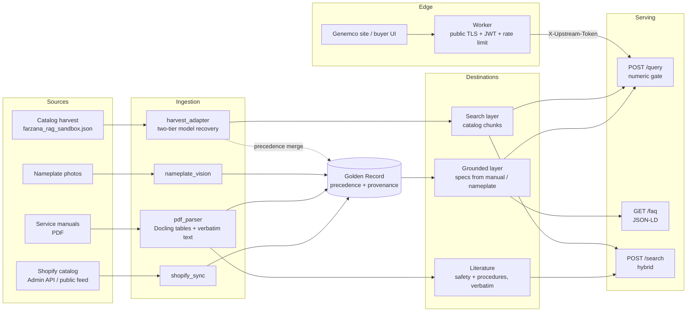

# Genemco Catalog RAG — Handover

Handover documentation for the Genemco retrieval system: architecture, schemas,
source mappings, ingestion evidence, the `/query` API, and how to operate it.

Everything below reflects the system as built and run. Items that depend on the
manual corpus (Muiz) or on inputs from Genemco are marked **PENDING** with the owner.

| Document | Purpose |
|---|---|
| [`docs/HANDOVER.md`](HANDOVER.md) | This file — architecture, schemas, logs, maintenance |
| [`docs/QUERY_API.md`](QUERY_API.md) | `/query` contract reference with real request/response pairs |
| [`docs/DEPLOYMENT.md`](DEPLOYMENT.md) | Runbook Muiz follows on `genemco-harvester` — install, token, smoke tests |
| [`reports/milestone2_streamA_completion_report.md`](../reports/milestone2_streamA_completion_report.md) | Criterion (a) completion evidence — the population measured, and what it does not claim |
| [`reports/milestone2_streamA_report.md`](../reports/milestone2_streamA_report.md) | Stream A run detail |

---

## 1. What the system does

It turns three kinds of source material into answers a buyer or technician can
trust:

- **Service manuals** (PDF) — engineering values with the page they came from.
- **Nameplate photos** — values read off the physical machine.
- **Catalog listings** — Genemco's product pages, for identity and search.

The central rule: **a number is only ever stated if it can be traced to a source,
and it is only called *verified* when that source is an engineering document.**
If a value cannot be grounded, the system says so instead of answering.

## 2. Status at a glance

| Area | Status |
|---|---|
| Golden Record schema, provenance, precedence | Done |
| PDF manual parsing (Docling), multi-model manuals | Done — validated on Frick 070.410-IOM |
| Safety text kept verbatim, barred from FAQs | Done |
| Catalog harvest adapter (two-tier model recovery) | Done |
| Catalog → search layer, Stream A run | Done — 15,939 / 15,939 |
| Numeric verification gate | Done |
| Grounded FAQ engine (manual sources only) | Done |
| `POST /query` verified endpoint, deployable service | Done |
| Deployment on `genemco-harvester` | **Live** — deployed by Muiz 16 Sep 2026; 5 of 5 smoke tests passed |
| Worker upstream switch to `127.0.0.1:9000` | **Done** — end-to-end integration verified, signed off by Muiz |
| Criterion (a), 85% completion | **PASS** — 15,939 / 15,939 (100%) on the loaded master catalog, the population Gerald chose 16 Sep 2026 |
| Active Stream A SKU list (6,084) | **PENDING — Genemco** (list or Admin API token); not required for criterion (a) as scoped |
| Manual corpus CORPUS_V1 ingestion | **PENDING — Muiz** (4 of 5 archive parts missing) |
| Search-layer embeddings / upsert | **PENDING — approval** (separate index required) |
| Nameplate photos | **PENDING — Genemco** |
| Genemco telemetry schema | **PENDING — Genemco** (built-in default in use) |

## 3. Architecture



**The request path, end to end:**

| Hop | Runs where | Responsibility |
|---|---|---|
| Buyer UI | genemco.com | Asks a question about one machine |
| Worker | public edge | TLS, JWT auth, rate limiting; strips any client-supplied `X-Upstream-Token` and sets its own; forwards the JSON body unchanged |
| `POST /query` | `genemco-harvester`, `127.0.0.1:9000` | Resolves the machine, grounds the answer, applies the numeric gate, returns citations |
| Golden Records | same VM, on disk | Loaded once at startup; no database, no outbound calls |

The service holds no API keys and makes no network calls of its own. Everything it needs is on disk beside it.

**Three destinations, deliberately separate:**

| Destination | Holds | Feeds | Never feeds |
|---|---|---|---|
| Grounded layer | Specs from `pdf_manual` / `nameplate` | `/query` (verified), `/faq` | — |
| Literature | DANGER / WARNING / procedures, verbatim, with page | `/search` | FAQ generator |
| Search layer | Catalog listing specs (`catalog_harvest`) | `/query` (unverified), `/search` | FAQ generator |

The FAQ generator reads only `pdf_manual`, `nameplate` and `telemetry` specs
(`faq/generator.py::FAQ_ELIGIBLE_SOURCES`). A catalog-only SKU returns zero FAQs
before any LLM call is made.

## 4. Repository map

| Path | Purpose |
|---|---|
| `core/schemas.py` | All Pydantic models — Golden Record, SpecValue, Chunk, FAQ, telemetry |
| `core/config.py` | Settings, read from environment / `.env` |
| `ingestion/shopify_sync.py` | Shopify Admin API and public-storefront sync |
| `ingestion/pdf_parser.py` | Docling table linearization, safety/procedure extraction |
| `ingestion/manual_map.py` | Manual → SKU manifest, RXF → XJF model tiers, model matching |
| `ingestion/nameplate_vision.py` | Vision-LLM nameplate extraction |
| `ingestion/harvest_adapter.py` | Catalog harvest → Golden Record |
| `ingestion/golden_record.py` | Record build, source precedence, `merge_catalog_specs` |
| `pipeline/chunking.py` | Spec, literature and catalog chunks |
| `pipeline/embeddings.py`, `vector_store.py` | Batched embeddings, Pinecone / Weaviate |
| `retrieval/hybrid_search.py`, `reranker.py` | Dense + BM25 + RRF + cross-encoder |
| `retrieval/verified_query.py` | `/query` engine — store, resolution, gate, citations |
| `faq/generator.py`, `faq/validator.py` | Grounded FAQs and the numeric gate |
| `api/query_app.py` | **Deployable** query service (`/health`, `/query`) |
| `api/query.py` | `/query` router and Worker shared-secret check |
| `api/main.py` | Full application (`/search`, `/faq`, `/telemetry/query`, `/query`) |
| `scripts/run_catalog_search_layer.py` | Catalog → search layer runner (Stream A) |
| `scripts/build_query_bundle.py` | Builds the deployable bundle (service code, data, checksums) |
| `scripts/ingest_sku.py`, `run_milestone1.py`, `run_full_ingestion.py` | Pipeline runners |
| `tests/` | Test suite |
| `reports/` | Shareable run reports |
| `data/`, `logs/`, `dist/` | Runtime data, logs, built bundles — **gitignored** |

## 5. Golden Record schema

One record per SKU (`core/schemas.py`).

```text
GoldenRecord
  sku              Shopify SKU; immutable identity
  shopify          ShopifyBlock   commercial identity (title, url, tags, stock, sync_mode)
  specs            {field: SpecValue}
  telemetry        {field: value}
  merge_meta       MergeMeta
  record_version, last_built

SpecValue                          every technical value carries full provenance
  value            the value (number or text)
  unit             unit, when the source states one
  source           shopify | pdf_manual | nameplate | telemetry | stream_c | catalog_harvest
  source_ref       "<manual>.pdf#page=N" | "nameplate:<sku>" | source URL
  method           docling_table | vision_llm | catalog_atomic | catalog_bundle_recovered | catalog_compound
  confidence       0–1
  source_text      verbatim source text the value was read from (citation quote)

MergeMeta
  conflicts        [{field, candidates[], reason}]   disagreements kept, never overwritten
  sources_used     [...]
  pdf_enrichment, nameplate_enrichment
  source_warnings  integrity notes raised by the source (e.g. serial_not_unique)
```

### Source precedence

| Field type | Winner |
|---|---|
| Electrical / serial (voltage, amperage, HP, phase, Hz, RPM, serial, year, refrigerant) | Nameplate |
| Dimensional / performance | PDF manual |
| Any technical field vs a catalog listing | Manual or nameplate — always |
| Commercial identity (title, URL, stock) | Shopify / catalog |

- A numeric disagreement beyond **5%** (`NUMERIC_CONFLICT_TOLERANCE_PCT`) is logged to
  `merge_meta.conflicts` and `logs/conflicts.jsonl`. The authoritative value stands.
- Catalog specs fill gaps **only** for SKUs that have no manual at all.
- Nameplate extractions below **0.7** confidence go to `logs/review_queue.jsonl`.

### Confidence values in use

| Source | Confidence |
|---|---|
| `pdf_manual` (Docling table) | 0.9 |
| `nameplate` | per-field, from the vision model |
| `catalog_harvest` atomic value | 0.5 |
| `catalog_harvest` recovered from a bundled string | 0.4 |
| `catalog_harvest` compound value kept whole | 0.35 |

All catalog confidences sit below the 0.7 review threshold by design.

## 6. Field mappings

### 6a. Shopify → `ShopifyBlock`

| Shopify | Golden Record | Note |
|---|---|---|
| first variant `sku` (else `handle`) | `sku` | |
| `title`, `handle`, `vendor`, `product_type` | same | |
| `tags` | `tags[]` | Admin: comma string · public feed: list — both handled |
| variant `inventory_quantity` / `available` | `inventory_status` | public feed has no counts |
| `images[].src` | `images[]` | |
| — | `sync_mode` | `admin_api` or `public_storefront` |

### 6b. Catalog harvest (v4) → Golden Record

Source: `farzana_rag_sandbox.json` — 15,939 records. Adapter: `ingestion/harvest_adapter.py`.

| Harvest field | Golden Record | Note |
|---|---|---|
| `id` | `sku` | Shopify SKU; 38 records use a URL fallback for 19 reused SKUs |
| `sku` | cross-check only | |
| `raw_model_code` | `shopify.title`; `package_model`, `compressor_model` | parsed from the title convention |
| `clean_model_code` | **not used** | collapses RXF-85-H and RXF-85H — 271 collisions |
| `atomic_specs` | `specs` (`catalog_atomic`, 0.5) | flattened view |
| `specs` (bundled) | recovered `specs` (`catalog_bundle_recovered`, 0.4) | restores values the flattening dropped |
| `verified_specs[].source_url` | `SpecValue.source_ref` | |
| `verified_specs[].source_page` | **not used as a page** | identical to `source_url` in all 66,334 entries |
| `spec_field` / `value` | numeric-gate target | coerced like the stored spec |
| `source_data_warnings` | `merge_meta.source_warnings` | 353 `serial_not_unique`, carried not corrected |
| `equipment_category` | `shopify.product_type` | |
| `question`, `answer`, `token_count` | **not used** | one templated question across all records |

The v4 `atomic_specs` flattening drops a nested value whenever its key collides with a
top-level key — erasing the compressor model (XJF151L) on packaged units (RXF-85-H).
The adapter reads both containers and recovers it. 288 records were affected; all recover.

### 6c. PDF manual (Docling) → `SpecRecord` → `SpecValue`

| Docling output | Golden Record |
|---|---|
| Table row / column labels | `SpecRecord.model`, `spec` (normalized) |
| Cell text | `value`, `unit` (unit recovered from `(PSI)`-style headers) |
| `table.prov[0].page_no` | `source_ref = "<manual>#page=N"` |
| Row + column + cell | `source_text` = `"<model> \| <label>: <cell>"` |

Multi-model manuals are filtered per SKU using `data/manual_map.json` (manual → SKUs)
and `data/model_map.json` (SKU → models, RXF → XJF). Model labels are matched exactly,
including variant letters (XJF 151A/M/L/N), comma lists (`85, 101`) and ranges (`12 - 19`).

### 6d. Manual corpus (CORPUS_V1) → Golden Record — **PENDING (Muiz)**

Known from `corpus_manifest.csv` (the only CORPUS_V1 file available so far):

| Manifest column | Planned mapping |
|---|---|
| `doc_id` | manual identity; key into the JSON sidecar |
| `manufacturer`, `model_family` | model matching for `manual_map.json` |
| `confidence_level` | ingest order — High (915) first; Low (884) needs manual re-check |
| `page_count` | capacity planning |
| `source_url` | `manual_urls.json` → `citation.url` in `/query` |
| `query_source` | traceability only |

**Not yet known:** the JSON sidecar schema (no sidecar extracted), and whether page
numbers survive for non-Frick layouts. Both are confirmed only when the corpus is
reconstructed. The `/query` engine needs no change: manual-derived records go into the
authoritative directory and are picked up on restart.

### 6e. Chunk types

| `doc_type` | Built from | Chunk id | Reaches FAQ? |
|---|---|---|---|
| `shopify` | identity block | `sha1(sku\|identity)` | no |
| `spec` | authoritative specs | `sha1(sku\|field)` | yes |
| `literature` | safety / procedure text, verbatim | `sha1(sku\|manual\|page\|i)` | no |
| `catalog` | catalog harvest specs | `cat_` + `sha1(sku\|field)` | no |

The `cat_` prefix stops a catalog upsert from overwriting the grounded chunk for the
same SKU and field.

### 6f. Two-tier model reconciliation

Industrial refrigeration units are sold as a **package** but specified as a
**compressor**. One SKU therefore carries two model identities, and specs attach to
different tiers:

| Tier | Example | Where the value comes from | Typical specs |
|---|---|---|---|
| Package | `RXF-85-H` (Frick RXF) | Product title, catalog listing, manual package tables | Oil charge, dimensions, refrigerant |
| Compressor | `XJF151L` (Frick XJF) | Nested catalog specs, manual compressor tables | Max speed, displacement, swept volume |

A question about oil charge is answered at the package tier; a question about maximum
speed is answered at the compressor tier. Both must resolve from the same SKU, so the
record stores both — `package_model` and `compressor_model` — parsed from the title
convention by `ingestion/harvest_adapter.py::extract_model_tiers`.

**The erasure this fixes.** The harvest's `atomic_specs` view flattens nested specs into
one dictionary, and a nested key silently overwrites nothing — it is simply dropped when
a top-level key of the same name already exists. On packaged units that erased the
compressor model entirely: `RXF-85-H` kept its package identity and lost `XJF151L`,
taking every compressor-tier spec with it. The adapter reads **both** the flattened and
the bundled containers and recovers the lost tier. 288 records were affected; all 288
recover.

**On the manual side** the same reconciliation is done by two maps, because one service
manual covers many models at both tiers:

| File | Maps | Today |
|---|---|---|
| `data/manual_map.json` | manual filename → SKUs it covers | `070.410-IOM.pdf` → WHB03, WHB02 |
| `data/model_map.json` | SKU → package model, and package → compressor (`rxf_to_xjf`) | WHB03/WHB02 → RXF-85 → XJF-151 |

Model labels are matched exactly, including variant letters (XJF 151A/M/L/N), comma
lists (`85, 101`) and ranges (`12 - 19`), so a row for model 101 never lands on model 85.

**Known gap:** `model_map.json` holds only the RXF-85 → XJF-151 pairing confirmed by
Genemco. The remaining RXF → XJF pairings must be read off the manual's model table
before the full corpus is ingested. An unmapped RXF SKU still works — it picks up its
package-tier rows and no compressor-tier rows — so the failure mode is missing specs,
never wrong ones.

## 7. Ingestion execution log summary

### Milestone 1

| Run | Result |
|---|---|
| Public-storefront validation (20 SKUs) | 20 / 20 complete |
| Frick 070.410-IOM manual (68 pages) | 34 tables detected; 116 rows; 14 specs each for WHB03 / WHB02 |
| Safety extraction | 96 distinct panels, verbatim, page-cited |
| Grounded FAQs (WHB03) | 5 published, 1 rejected by the numeric gate |
| Exceptions | 4 — all intentional skips (table of contents, pressure-transducer grid) |

### Milestone 2 — Stream A catalog run

Evidence: [`reports/milestone2_streamA_report.md`](../reports/milestone2_streamA_report.md).

| Measure | Value |
|---|---|
| Records processed | 15,939 (entire harvest) |
| Completed | 15,939 — **100%** |
| Failed | 0 |
| Completed with at least one spec | 15,937 (99.99%) |
| Specs produced | 72,724 |
| Search chunks produced | 88,663 |
| Dual-source SKUs (manual + catalog) | 20 |
| Catalog values blocked by manual | 30 |
| Conflicts logged (manual wins) | 3 |
| Manual spec sets altered | **0** |
| Duplicate-serial flags carried | 353 |
| Run time | 8.9 s |

**Population and scope.** No data held by this project identifies which SKUs are active,
so the run covered the whole harvest. On 16 Sep 2026 Gerald directed that criterion (a)
be validated against the master catalog dataset loaded in the deployed service, which is
what [`reports/milestone2_streamA_completion_report.md`](../reports/milestone2_streamA_completion_report.md)
measures: **15,939 of 15,939 complete, 100.0%, against an 85% gate — PASS**.

With zero failures, any subset of that dataset is also complete at 100%. What the
measurement cannot show is whether an active SKU exists that is absent from the master
dataset altogether — that would need the active-SKU list or Admin API access. No filtered
active set was supplied or validated against.

### CORPUS_V1 manifest check

| Check | Result |
|---|---|
| Documents in manifest | 2,583 |
| Confidence tiers High / Medium / Low | 915 / 784 / 884 — matches handover |
| sha256 entries | 5,166 (2,583 PDFs + 2,583 sidecars) |
| High tier | 180 manufacturers, 54,187 pages; Frick is 15 of 915 |
| Archive parts present | **1 of 5** (`.04` only) — **cannot be reconstructed** |

### Where logs live

| File | Contents |
|---|---|
| `logs/exceptions.jsonl` | unparseable PDFs, skipped tables, FAQ gate rejections |
| `logs/conflicts.jsonl` | precedence conflicts |
| `logs/review_queue.jsonl` | low-confidence nameplate extractions |
| `logs/milestone1_report.json` | Milestone 1 validation run |
| `logs/milestone2_streamA_report_detail.json` | per-SKU Stream A outcomes |
| `reports/milestone2_streamA_report.{md,json}` | shareable Stream A summary |

## 8. `/query` API reference

Captured request/response pairs for every case: [`docs/QUERY_API.md`](QUERY_API.md).
Install steps: [`docs/DEPLOYMENT.md`](DEPLOYMENT.md).

### Where it runs

| | |
|---|---|
| Host | `genemco-harvester` (permanent RAG VM) |
| Address | `127.0.0.1:9000` — loopback only, never exposed to the internet |
| Public edge | the Worker, which owns TLS, JWT auth and rate limiting |
| Worker upstream | `http://127.0.0.1:9000/query` |
| systemd unit | `genemco-query` |
| Install path | `/opt/genemco-query`, config in `/etc/genemco-query/query.env` |

**Live since 16 Sep 2026.** Muiz deployed the bundle on `genemco-harvester`, ran all five
smoke tests in `DEPLOYMENT.md` section 5 green — including a missing token correctly
rejected with `401` — cut the Worker over to `http://127.0.0.1:9000/query`, and signed off
the integration on his side. Two questions asked through the full public chain returned
exactly the documented responses:

| Question | Result | Latency |
|---|---|---|
| RXF-85-H oil charge | `verified: true`, cited 070.410-IOM.pdf page 7 | 18.8 ms |
| RXF-999 (unknown machine) | `ungrounded: true`, `X-Query-Outcome: unknown_machine` | — |

The verification record is in `DEPLOYMENT.md` section 9. These results were produced on
the VM by Muiz; they have not been re-run from the development machine, which has no
access to the host.

### Endpoints

| Method | Path | Purpose | Token |
|---|---|---|---|
| `POST` | `/query` | Ask about one machine | required |
| `GET` | `/health` | Liveness and readiness | not required |

### Request

```json
{ "query": "What is the oil charge?", "model_code": "RXF-85-H", "top_k": 3 }
```

| Field | Type | Required | Rules |
|---|---|---|---|
| `query` | string | yes | 2–500 characters |
| `model_code` | string | no | up to 120 characters. Matched exactly, hyphens included — `RXF-85-H` and `RXF-85H` are different machines. When omitted, codes are read out of `query` |
| `top_k` | integer | no | 1–10, default 3 — maximum citations returned |

### Response

Five fields, always present, always in this order:

```json
{
  "answer": "The basic charge of RXF-85-H is 36 gallon.",
  "verified": true,
  "confidence": 0.9,
  "citations": [
    { "manual": "070.410-IOM.pdf", "manual_slug": "070-410-iom", "source_page": 7,
      "url": null, "quoted_span": "85, 101 | BASIC CHARGE (gallon): 36" }
  ],
  "ungrounded": false
}
```

| Field | Type | Meaning |
|---|---|---|
| `answer` | string or null | Null exactly when `ungrounded` is true |
| `verified` | boolean | True only when every citation is an engineering source |
| `confidence` | number 0–1 | Lowest confidence among the cited values; 0.0 when ungrounded |
| `citations` | array | Where the values came from; empty when ungrounded |
| `ungrounded` | boolean | True when nothing could be grounded |

Citation fields: `manual` and `manual_slug` (the document, or `genemco_catalog_<SKU>`),
`source_page` (integer, or null for catalog listings), `url` (product page for catalog
values; null for manuals until `data/manual_urls.json` is populated) and `quoted_span`
(the verbatim source text the value was read from, never paraphrased).

### Verified, grounded and ungrounded

| Case | `verified` | `ungrounded` | `answer` |
|---|---|---|---|
| Manual value with a page, or a nameplate | `true` | `false` | stated |
| Catalog listing value | `false` | `false` | stated, with the product page as the citation |
| Unknown machine, spec not carried, machines disagree, gate rejection | `false` | `true` | `null` |

A refusal is a normal `200` response with exactly this body:

```json
{ "answer": null, "verified": false, "confidence": 0.0, "citations": [], "ungrounded": true }
```

### Auth header

| | |
|---|---|
| Header | `X-Upstream-Token: <token>` — the raw value, no `Bearer` prefix |
| Required on | `POST /query` |
| Not required on | `GET /health` |
| Missing or wrong | `401` with `{"detail": "unauthorized"}` |
| Comparison | constant time (`hmac.compare_digest`), in `api/query.py` |
| Where the value lives | `QUERY_UPSTREAM_TOKEN` in `/etc/genemco-query/query.env` on the VM, and in the Worker's own config. Generated on the VM, never in the repo |

If `QUERY_UPSTREAM_TOKEN` is unset or empty the check is skipped and any process on the
VM can call `/query`. It must always be set.

Public clients never see this token: they authenticate to the Worker with a JWT, and the
Worker strips any `X-Upstream-Token` a client sends before setting its own.

### `X-Query-Outcome` response header

Why an answer was withheld travels in a header, so the response body stays fixed. Worth
logging on the Worker — a rising share of one value points at a data or wording gap.

| Value | Meaning |
|---|---|
| `ok` | Answered |
| `no_machine_named` | No `model_code`, and no model code found in `query` |
| `unknown_machine` | The model code or SKU is not in the data |
| `no_spec_named` | The question names no specification |
| `spec_not_carried` | The machine carries no spec matching the question |
| `ambiguous_spec_in:<SKU>` | Two fields match equally well and hold different values |
| `machines_disagree:<n>` | `n` matching machines state different values |
| `gate_rejected:[...]` | The composed answer held numbers that were not in the cited values |

### Status codes

| Status | When |
|---|---|
| `200` | Answered, or safely refused (`ungrounded: true`) |
| `401` | Token missing or wrong |
| `422` | Request validation failed (empty `query`, `top_k` out of range) |
| `503` | `/health` only — golden records not loaded |

`GET /health` returns `{"status": "ok", "store": {...}}` with the loaded record counts,
or `503` with `"degraded"` while records are missing, so the Worker can hold traffic.

## 9. The verification gate

The gate is what separates this system from a chatbot that sounds confident. Two
independent checks stand between a stored value and a published answer: **numeric
grounding** and **source class**.

### How an answer is built

| Step | What happens | Refusal outcome |
|---|---|---|
| 1. Resolve the machine | `model_code`, else codes found in `query`. Exact match, hyphens significant | `no_machine_named`, `unknown_machine` |
| 2. Identify the spec | Intent tokens from the question, with aliases and stopwords. Manufacturer names never count as the spec asked for. Serial, part and certificate fields answer only when asked for by name. A field must cover at least half of itself or of the question | `no_spec_named`, `spec_not_carried`, `ambiguous_spec_in:<SKU>` |
| 3. Check agreement | Every matching machine carrying that spec must state the same value; units must match or be stated on one side only | `machines_disagree:<n>` |
| 4. Compose | The sentence is built extractively from the cited value — no generation, no rounding, no unit conversion | — |
| 5. Numeric grounding | Every number in the composed answer must be a cited value | `gate_rejected:[...]` |
| 6. Cite | Manual sources first, one citation per distinct source location, up to `top_k` | — |

Step 2 exists because of a real failure: "horsepower" on a Vilter package matched a
Vilter oil-separator serial number, purely on the brand word. Brand tokens are now
removed and identifier fields are gated.

### Numeric grounding

Every number in the answer is compared against the values of the specs it cites, with
unit-tolerant comparison. Tokens that are identifiers rather than measurements — a code
such as `0127L`, and label or product-name spans — are masked first, so a digit inside a
serial number can never stand in for a measurement. If any number survives unmatched,
the whole answer is withheld and the header names the offending tokens.

The same gate guards the FAQ layer (`faq/validator.py`), which rejected 1 of 6 generated
FAQs on WHB03.

### Page citations

Page numbers are captured at parse time, not inferred later. Docling reports the page of
each table it reads (`table.prov[0].page_no`); the parser stores it as
`source_ref = "<manual>#page=N"` together with `source_text`, the verbatim row the value
came from. `/query` passes both straight through as `source_page` and `quoted_span`, so a
technician can open that page and see the same row. Catalog values carry a product URL
instead and therefore never have a page — which is exactly why they cannot verify.

### The guarantee

- **No unsourced numbers.** A number appears in an answer only if it is a value in a
  cited source.
- **Verified means engineering-grade.** `verified: true` requires every citation to be a
  service manual with a page number, or a nameplate. A catalog listing can ground an
  answer but can never verify one.
- **Silence over a guess.** An unknown machine, a spec the machine does not carry, or
  sources that disagree produce a refusal, never a best guess.
- **Authoritative sources are never overwritten.** Manual and nameplate values beat
  catalog values for the same field; disagreements are logged, and the authoritative
  value stands. The Stream A run altered **0** manual spec sets.

What it does **not** guarantee: that the underlying source is correct. Where the catalog
contradicts itself (XJB151 at 7,000 RPM on two listings and 700 RPM on a third), the
service refuses the question — the fix is a catalog correction on Genemco's side.

## 10. Operations and maintenance

### Run and restart the service (systemd)

On `genemco-harvester`, the service runs as the systemd unit `genemco-query`. Full
install and smoke tests: [`docs/DEPLOYMENT.md`](DEPLOYMENT.md).

```bash
sudo systemctl status genemco-query --no-pager     # is it up
sudo systemctl restart genemco-query               # restart
sudo systemctl stop genemco-query                  # stop
journalctl -u genemco-query -f                     # live logs
journalctl -u genemco-query -n 50 --no-pager       # last 50 lines
curl -s http://127.0.0.1:9000/health; echo         # readiness
```

A healthy start logs `golden store loaded:` with the record counts, and `/health`
returns `200` with `"status":"ok"`. The unit is enabled, so it also comes back after a
reboot.

**Records are read once, at startup — restart after any data refresh:**

```bash
sudo chown -R genemco-query:genemco-query /opt/genemco-query/data
sudo systemctl restart genemco-query
curl -s http://127.0.0.1:9000/health; echo
```

**Updating the code.** Build a new bundle from this repo, then unpack it over
`/opt/genemco-query` and restart. The config file is untouched by an upgrade.

```bash
python -m scripts.build_query_bundle    # writes dist/genemco-query-service-<date>-<commit>.tar.gz
```

The build refuses to run if the bundled code differs from the last commit, or if the
service imports a module the bundle would leave out — so what ships is always a commit.

**Locally, for development** (no systemd):

```bash
pip install -r requirements-query.txt
GENEMCO_API_HOST=127.0.0.1 GENEMCO_API_PORT=9000 python -m api.query_app
```

### Refresh the catalog search layer

```bash
python -m scripts.run_catalog_search_layer                       # whole harvest
python -m scripts.run_catalog_search_layer --sku-list data/stream_a_skus.csv
```

Writes `data/search_layer/*.jsonl` atomically, never writes authoritative records,
and regenerates `reports/milestone2_streamA_report.*`. Conflicts append to
`logs/conflicts.jsonl` on each run.

### Add a service manual

1. Put the PDF in `data/pdf_manuals/`.
2. If it covers several SKUs, add it to `data/manual_map.json`; add model tiers to
   `data/model_map.json` if titles do not carry them.
3. Re-ingest those SKUs (`scripts/ingest_sku.py`). Check `logs/exceptions.jsonl` for
   skipped tables and the table inventory for layouts the parser does not handle.
4. Restart the query service.

### Onboard the manual corpus — **PENDING (Muiz)**

1. Obtain all five `gencorpus_v1.tar.0*` parts.
2. Join, extract, and verify with `sha256sum -c corpus.sha256` **inside the extracted tree**.
3. Ingest **High** confidence first, starting with a micro-sample; confirm page citations
   are real for non-Frick layouts before scaling.
4. Build `data/manual_urls.json` from `corpus_manifest.csv` `source_url`.
5. Budget CPU, not API spend: Docling processed 68 pages in about 13 minutes on the
   development machine; the High tier is 54,187 pages.

### Monitor

| Signal | Action |
|---|---|
| New lines in `logs/exceptions.jsonl` | Unparseable PDFs or skipped tables — review |
| New lines in `logs/conflicts.jsonl` | Sources disagree — decide which is right |
| Entries in `logs/review_queue.jsonl` | Nameplates below 0.7 confidence — human check |
| `/health` returning 503 | Records not loaded — check data paths |
| High share of `ungrounded` in `X-Query-Outcome` | Missing specs or unmatched wording |

### Rotate the shared token

`QUERY_UPSTREAM_TOKEN` is the secret between the Worker and the service. It is generated
on the VM and exists in exactly two places on that box: the service config file and the
Worker config. It is never in the repo, never in chat, and never printed.

```bash
# 1. generate a new value straight into the service config (nothing is displayed)
TOKEN="$(python3.12 -c 'import secrets; print(secrets.token_urlsafe(32))')"
sudo sed -i "s|^QUERY_UPSTREAM_TOKEN=.*|QUERY_UPSTREAM_TOKEN=${TOKEN}|" /etc/genemco-query/query.env
unset TOKEN

# 2. copy it into the Worker config without displaying it
#    (replace the Worker file and variable name with the real ones)
sudo sed -n 's/^QUERY_UPSTREAM_TOKEN=/<WORKER_TOKEN_VAR>=/p' /etc/genemco-query/query.env \
  | sudo tee -a <WORKER_ENV_FILE> > /dev/null

# 3. restart both, service first
sudo systemctl restart genemco-query
# restart the Worker
```

Then re-run smoke tests 3 and 4 in `DEPLOYMENT.md` section 5: a call with no token must
give `401`, and a call through the Worker must still answer.

Rotate it whenever someone with VM access leaves, or if the value is ever pasted into a
chat, ticket or log. Other secrets (OpenAI, Pinecone, Shopify) belong to the ingestion
side only — the query service needs none of them — and rotate the same way: change the
value at the provider, update the environment, restart the process.

### Troubleshooting

| Symptom | Likely cause | Fix |
|---|---|---|
| `/health` gives `503`, or `"records":0` | Data paths wrong or files missing | Check `GENEMCO_GOLDEN_DIR` and `GENEMCO_CATALOG_PATH` in `/etc/genemco-query/query.env` |
| `401` on every query | Token mismatch, or the Worker is not sending the header | Re-copy the token as above; the header name is exactly `X-Upstream-Token`, with no `Bearer` prefix |
| Everything answers `ungrounded` | The question names no machine, or the specs are not carried | Read `X-Query-Outcome`: `no_machine_named` is a wording problem, `spec_not_carried` is a data gap |
| One machine answers wrongly | A source value is wrong, not a gate failure | Follow `quoted_span` and `source_page` to the source; fix the catalog listing or re-parse the manual |
| `machines_disagree` on a common question | Catalog listings contradict each other | Correct the listing on Genemco's side; the service will answer once they agree |
| Service keeps restarting | Startup error | `journalctl -u genemco-query -n 50 --no-pager` |
| `Address already in use` | A foreground run is still holding port 9000 | `ss -ltnp \| grep :9000`, stop that process |
| `ModuleNotFoundError: No module named 'api'` | Started outside the install directory | Keep `WorkingDirectory=/opt/genemco-query` in the unit |
| Answers are stale after a data refresh | Records load only at startup | `sudo systemctl restart genemco-query` |

### Tests

```bash
pytest tests/ -v
```

## 11. Known limitations

- Catalog data comes from the public product feed: no inventory counts, cost, or
  unpublished products until the Shopify Admin token is supplied.
- Catalog `source_page` is a URL, so catalog citations have no page number.
- Manual citations have `url: null` until `manual_urls.json` is populated.
- Allowable Flange Loads and CH Coupling Data tables are keyed by nozzle / coupling size,
  not model, so they are not attached to SKUs; coupling fractions decode incorrectly.
- Shared manuals are stored per SKU (duplicated literature chunks) — restructure before
  the full corpus.
- The FAQ gate rejects numbers that appear only in a column heading (e.g. "3550" in
  "Cfm 3550 Rpm"). Kept strict by decision.
- Precedence rules have not yet been exercised against a real nameplate.
- Values stated only in a product title — e.g. horsepower and voltage in
  "(Vilter VSS1201, 500 Hp, 460 V)" — are not in `specs{}`, so `/query` does not answer them.
- The catalog contradicts itself in places: XJB151 listings show 7,000 RPM on TPC46 / TPC47
  but 700 RPM on TPC28. `/query` refuses such questions rather than choosing a value;
  these are catalog-side corrections for Genemco.
- `/query` resolves a machine by model code or SKU; queries naming no machine are refused.
  Retrieval is lexical over Golden Records; vector retrieval can be added behind the same
  contract.

## 12. Pending items

| Item | Owner | Unblocks |
|---|---|---|
| CORPUS_V1 parts `.00`–`.03` | Muiz | Manual-corpus ingestion, grounded layer at scale |
| CORPUS_V1 JSON sidecar schema confirmation | Muiz | Manual field mapping (6d) |
| Stream A active SKU list, or Shopify Admin API token | Genemco | 6,084-SKU coverage proof; inventory data |
| Separate vector index / namespace for the search layer | Genemco (approval) | Catalog embeddings |
| Nameplate photos | Genemco | Nameplate precedence, conflict detection |
| Telemetry schema | Genemco | Diagnostics on Genemco's alarm format |
